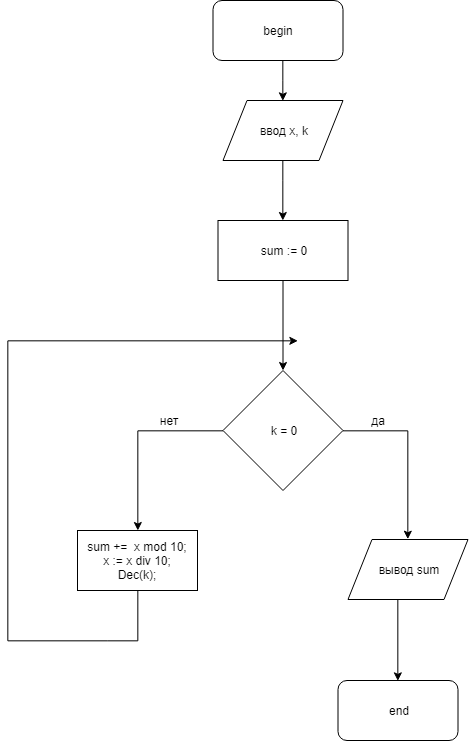

# Лабораторная работа №1.7

## Задание
Дано целое число __X__. Определить сумму __k__ младших цифр в записи числа.

## Блок-схема алгоритма

## Код
[Файл](src/lab.pas)

## Тесты
Введем индикатор ошибки: -1.
* Заметим, что если __k__ < 0, то ошибка.
* Если __k__ > количества цифр __X__, то мы мысленно можем добавить лидирующие 0

### Testcase 1
|Step|   X|   k| ret|
|----|----|----|----|
|   0| 123|   2|   0|
|   1|  12|   1|   3|
|   2|   1|   0|   5|

### Testcase 2
|Step|   X|   k| ret|
|----|----|----|----|
|   0|4321|   4|   0|
|   1| 432|   3|   1|
|   2|  32|   2|   3|
|   3|   1|   1|   6|
|   4|   0|   0|  10|

### Testcase 3
|Step|   X|   k| ret|
|----|----|----|----|
|   0|   1|   1|   0|
|   1|   0|   0|   1|

### Testcase 4
|Step|   X|   k| ret|
|----|----|----|----|
|   0|  -7|   2|   0|
|   1|   0|   1|   7|
|   2|   0|   0|   7|

### Testcase 5
|Step|   X|   k| ret|
|----|----|----|----|
|   0|  12|  -1|   0|
|   0|  12|  -1|  -1|