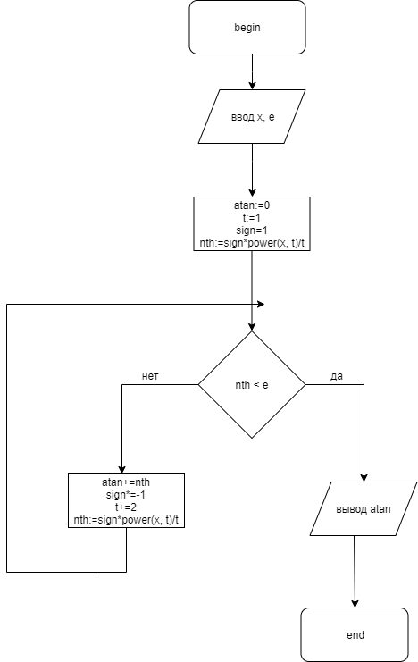

# Лабораторная работа №2.7

## Задание
atan(x) = x - x^3/3 + x^5/5 - ... + (-1)^n * x^(2n + 1)/(2n + 1) + ...

## Блок-схема алгоритма

## Код
[Файл](src/lab.pas)

## Тесты
Введем индикатор ошибки: -1.
* Заметим, что если eps == 0, то ошибка.
* Если eps <= 0, то мы берем |eps|
