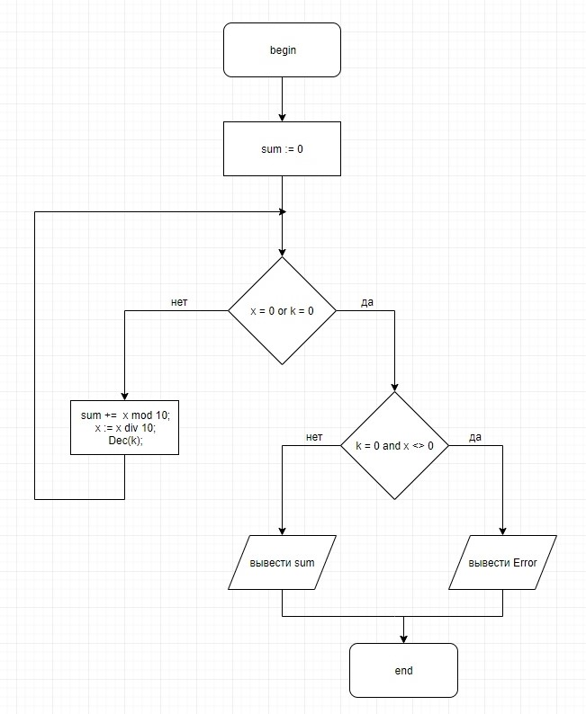

# Лабораторная работа №1.7

## Задание

Дано целое число __X__. Определить сумму __k__ младших цифр в записи числа.

## Блок-схема алгоритма


## Код

[Файл](lab.pas)

```
program Lab1;

var x, k : integer;

(* function returning sum of 'k' lower digits in a number *)
function get_k_sum(x, k : integer) : integer;
begin
    get_k_sum := 0;

    while (x <> 0) and (k <> 0) do
    begin
        get_k_sum += (x mod 10);
        x := (x div 10);
        Dec(k);
    end;

    if (k = 0) and (x <> 0) then
        get_k_sum := -1;
end;

begin
  write('Input x: '); read(x);
  write('Input k: '); read(k);

  writeln('Answer: ', get_k_sum(x, k))
end.
```

## Тесты
